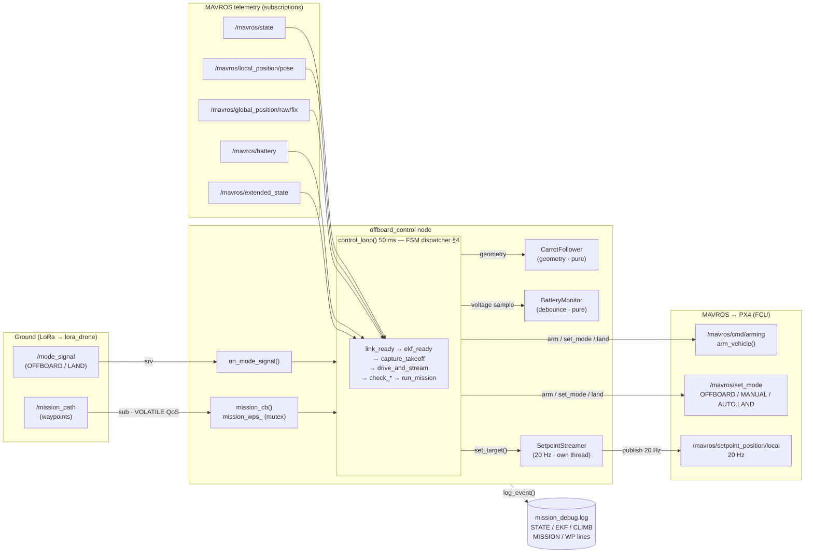
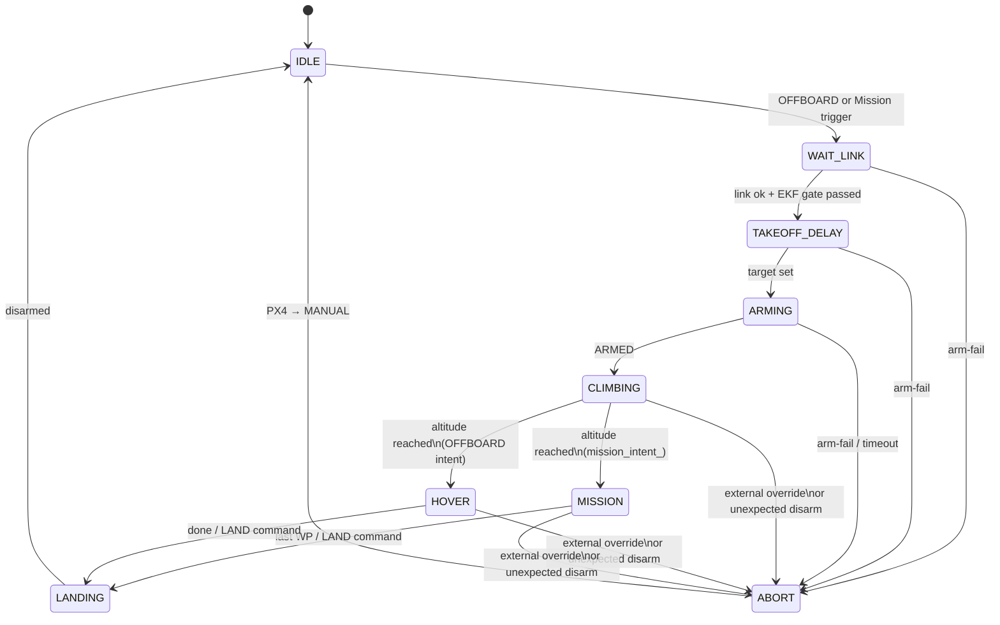

# offboard_control — Architecture

Autonomous flight controller for a PX4 drone via MAVROS: state machine, control loop, mission flight, and safety. The node `OffboardMode` orchestrates; the geometry and the setpoint thread live in their own modules.

Scope: this C++ package only. For the full pipeline (Ground GUI ↔ LoRa ↔ lora_drone), see `lora_drone_package/README.md`.

---

## Table of contents

1. [Module layout](#1-module-layout)
2. [Triggers — OFFBOARD vs Mission](#2-triggers--offboard-vs-mission)
3. [State machine](#3-state-machine)
4. [Control loop](#4-control-loop)
5. [Setpoint streamer (module)](#5-setpoint-streamer-module)
6. [Mission flight — carrot follower (module)](#6-mission-flight--carrot-follower-module)
7. [Coordinate system](#7-coordinate-system)
8. [Safety mechanisms](#8-safety-mechanisms)
9. [Threading model](#9-threading-model)
10. [Module API reference](#10-module-api-reference)
11. [Extending & reusing](#11-extending--reusing)
12. [Roadmap](#12-roadmap)

---

## 1. Module layout

The package is split so each concern is isolated and (where possible) testable on its own:

| File | Role | ROS deps? |
|---|---|---|
| `offboard_control.{hpp,cpp}` | Node: ROS wiring + FSM orchestration | yes |
| `carrot_follower.{hpp,cpp}` | Pure waypoint-following geometry (Module 1) | **no** — unit-testable |
| `setpoint_streamer.{hpp,cpp}` | Dedicated >2 Hz setpoint thread + RT priority (Module 2) | yes (wraps a publisher) |
| `battery_monitor.{hpp,cpp}` | Pure battery sustained-low debounce (Module 3) | **no** — unit-testable |

### Component & data-flow diagram

How the node, the three modules, and MAVROS/PX4 wire together. Left = inputs the node reacts
to; centre = the node (FSM) + the modules it delegates to; right = commands out to the vehicle.



- **Inputs (left):** ground commands over `/mode_signal` + `/mission_path`; live FCU telemetry from MAVROS (state, pose, GPS fix, battery, landed-state).
- **Node (centre):** the 50 ms `control_loop` FSM dispatcher (§4) decides phase and delegates — *geometry* to `CarrotFollower`, *battery debounce* to `BatteryMonitor`, *the setpoint heartbeat* to `SetpointStreamer` (its own 20 Hz thread).
- **Outputs (right):** arm/disarm, set_mode (OFFBOARD/MANUAL/AUTO.LAND), and the position setpoint stream — all to MAVROS → PX4.

MAVROS arm/set_mode/land stays in the node (a `VehicleIO` wrapper was considered and **skipped** — §10.4).

The node keeps the FSM (`state_`, `transition_to`, `control_loop` dispatcher), ROS plumbing, and the MAVROS command calls; it delegates geometry to `CarrotFollower`, the streaming thread to `SetpointStreamer`, and the battery debounce to `BatteryMonitor`.

CMake builds all source files together into the single `offboard_control` executable — add new `.cpp` files to `add_executable(...)` in `CMakeLists.txt`.

---

## 2. Triggers — OFFBOARD vs Mission

The two ground commands map to two distinct flights, kept strictly separate by the `mission_intent_` flag:

| Trigger | Effect | `mission_intent_` |
|---|---|---|
| **OFFBOARD** (`/mode_signal`) | arm → takeoff → **hover** → land. Ignores any mission in the inbox. | false |
| **Mission** (`/mission_path`, while idle) | auto-starts: arm → takeoff → **fly waypoints** → land. The mission message is its own GO. | true |

- A mission only auto-starts when the node is **idle** (same condition as `handle_inactive`) — a mission arriving mid-flight is stored, not acted on.
- `decide_mission_vs_hover()` flies waypoints **only when `mission_intent_` is true**, so a stale mission can never turn an OFFBOARD-hover into a mission.
- The `/mission_path` subscription uses **VOLATILE** QoS (not transient-local): lora_drone's latched mission history is **not** replayed on startup, so an old mission can never launch the drone at boot.

---

## 3. State machine

### States

`enum class FlightState` — `state_` is the single source of truth for the current flight phase:

| State | Meaning |
|---|---|
| `IDLE` | Waiting for a trigger |
| `WAIT_LINK` | Triggered; waiting for fresh pose/state + FCU link **and** the pre-takeoff EKF gate (GPS 3D fix + stable local-z, §8). The setpoint stream is primed (current pose) throughout this wait. |
| `TAKEOFF_DELAY` | Priming setpoint stream before entering OFFBOARD mode |
| `ARMING` | Takeoff target set; requesting OFFBOARD + ARM |
| `CLIMBING` | Armed; climbing to takeoff altitude |
| `HOVER` | At altitude, OFFBOARD intent — holding position |
| `MISSION` | Executing waypoint mission |
| `LANDING` | AUTO.LAND in progress |
| `ABORT` | External override / arm failure — returning PX4 to MANUAL |

### Transition diagram



### `transition_to()` — single transition point

All `state_` changes go through one function; each produces one `STATE: X -> Y` line in the log (console + mission_debug.log):

```cpp
void OffboardMode::transition_to(FlightState s) {
    if (s == state_) return;
    RCLCPP_INFO(..., "STATE %s -> %s", state_name(state_), state_name(s));
    log_event("STATE: " + old + " -> " + s);
    state_ = s;
}
```

`state_ == MISSION` is now the source of truth for "currently flying waypoints" (the old `flying_mission_` flag was retired, STEP 3).

---

## 4. Control loop

50 ms timer (`create_wall_timer(50ms, control_loop)`). `control_loop()` is a thin dispatcher that calls one helper per phase, in order (a helper returning `true` ends the tick early):

1. `handle_inactive()` — idle / landed / aborted: stop stream; if just aborted, return PX4 to MANUAL.
2. `begin_takeoff_delay(now)` — start the takeoff-delay window (primes the setpoint stream).
3. `link_ready(now)` — require fresh pose (`< 1.0 s`), state (`< 1.5 s`), and `FCU connected`.
4. **`ekf_ready(now)` — pre-takeoff EKF gate (§8): block ARM until a fresh GPS 3D fix AND local-z stable for `ekf_z_stable_sec`. Latched by `ekf_gate_passed_` — runs ONLY until it passes, never again mid-flight (a climbing z must not re-trip it). While waiting: hold current pose (prime) + stay in WAIT_LINK.**
5. `prime_during_delay(now)` — hold current pose during the delay window.
6. `capture_takeoff_target(now)` — latch `ground_z_` once; target z = `ground_z_ + climb_height` (→ ARMING). `climb_height` = **first waypoint's altitude** for a mission, else `takeoff_height_` (§7).
7. `check_external_override(now)` — PX4 left OFFBOARD after stable → ABORT.
8. `drive_and_stream(now)` — `set_offboard_mode()` + `arm_vehicle()` + stream target + stream watchdog.
9. `check_arm_watchdogs(now)` — arm-fail timeout + unexpected disarm → ABORT.
10. `check_altitude_progress(now)` — detect altitude reached (within `alt_reached_tol`) + altitude timeout (→ emergency land). Emits a throttled `CLIMB:` progress line to the log.
11. `run_mission_or_hover(now)` — `decide_mission_vs_hover()`, then `fly_active_mission()` (§6, emits throttled `MISSION:` lines) or hover.
12. `finalize_if_landed()` — landed + disarmed → IDLE.

Most helpers are verbatim extractions of the old monolithic loop (STEP 2 refactor, §10); the `ekf_ready` gate (step 4) and the mission-altitude takeoff (step 6) were added later — see §8 and §7.

---

## 5. Setpoint streamer (module)

`SetpointStreamer` (`setpoint_streamer.hpp`) — PX4 exits OFFBOARD if no setpoint arrives for > ~0.5 s, so a dedicated thread guarantees the rate regardless of what the control loop is doing.

- Owns its thread, target mutex, `running`/`streaming` atomics, and heartbeat. The node just calls `set_target(p)`, `set_streaming(false)`, `streaming()`, `last_publish_ns()`.
- Publishes at `setpoint_rate_hz` (20 Hz) with deadline-based pacing.
- Tries **`SCHED_FIFO` priority 80** (needs container `--privileged` / CAP_SYS_NICE). Log: `Setpoint streamer running at SCHED_FIFO priority 80`, else a warning and normal scheduling.
- **Heartbeat:** `last_publish_ns()`; the control loop's watchdog (`drive_and_stream`) warns if the stream stalls > 250 ms while armed.

---

## 6. Mission flight — carrot follower (module)

`CarrotFollower` (`carrot_follower.hpp`) — **pure geometry, no ROS**, so it can be unit-tested standalone. Instead of commanding the far waypoint (PX4 sprints then brakes at corners), it advances a **carrot** (intermediate setpoint) toward the active waypoint:

- `begin(wps, ground_z, start_x/y/z)` — load the mission, seat the carrot at the drone's position.
- `update(drone_x/y/z, wp_elapsed)` → `Result{ setpoint, event, by_timeout, wp_index, drone_dist }`.
  - Carrot advances `cruise_speed × dt` toward the WP, never leading the drone by more than `carrot_lead`.
  - Event `WAYPOINT_PASSED` when the carrot flows through an intermediate WP (or `wp_timeout`).
  - Event `MISSION_COMPLETE` when the drone is within `wp_reach_radius` of the final WP (or `wp_timeout`).
- The node (`fly_active_mission`) sets the setpoint from the result and acts on the event: log it, reset its WP timer, or `land_vehicle()`.

**Consume pattern (no replay):** at mission start, `decide_mission_vs_hover` hands a private copy of the inbox `mission_wps_` to `follower_.begin()` and clears the inbox. A completed mission does not repeat — send a new mission to fly again.

Tuning: `carrot_lead ≈ cruise_speed × 1.0–1.3`.

---

## 7. Coordinate system

All z values are **relative to takeoff ground**:

| Phase | z source | Value |
|---|---|---|
| Takeoff — **Mission** | altitude of the **first waypoint** | drone climbs straight to mission altitude (no 5m→mission-alt step) |
| Takeoff — **OFFBOARD hover** | param `takeoff_height_` | 5 m default |
| Waypoint flight | z field in each `/mission_path` pose | relative to takeoff ground, set by ground station |

`capture_takeoff_target` picks the climb height per trigger: for a mission it reads the first waypoint's z (sane positive value, else falls back to `takeoff_height_`); for an OFFBOARD hover it uses `takeoff_height_`. This removes the old mismatch where the drone took off to a fixed 5 m and the carrot then had to pull it up to the mission altitude.

`ground_z_` = EKF local-z **locked at ARM** (`capture_takeoff_target`). All targets are offset: `target_z = ground_z_ + relative_z` — robust regardless of where the EKF local-z origin sits.

> **EKF convergence:** arming before the EKF local position converges gives a drifting `ground_z_`/local-z, so the altitude check never triggers → climb timeout → emergency land. This is now handled in software by the **pre-takeoff EKF gate** (§8): the drone waits on the ground (state `WAIT_LINK`) for a GPS 3D fix + a stable local-z before it will arm, so a fresh-from-boot launch no longer fails this way. Good field practice still applies: power on outdoors, let GPS lock and the airframe sit still.

---

## 8. Safety mechanisms

| Mechanism | Condition | Action |
|---|---|---|
| **EKF gate (pre-takeoff)** | No fresh GPS 3D fix, **or** local-z not stable (within `ekf_z_stable_thresh` 0.30 m for `ekf_z_stable_sec` 3 s) | Hold on ground in `WAIT_LINK`, do not ARM (prime stream meanwhile) |
| **Altitude timeout** | Armed, altitude not reached within `climb_timeout_sec` (60 s, anchored to `arm_time`) | Emergency land |
| **Low battery (debounced)** | Armed, V < `min_battery_` (13.2 V) continuously for ≥ `low_batt_hold_sec` (5 s) | Emergency land |
| **Stale FCU / pose** | `!connected` or pose/state older than threshold | Stop setpoint stream |
| **Arm-fail timeout** | ARM not achieved within `arm_timeout_sec` (15 s) | ABORT → MANUAL |
| **Unexpected disarm** | PX4 disarms while in flight | ABORT → MANUAL |
| **External override** | PX4 leaves OFFBOARD for > `offboard_stable_sec` (3 s) | ABORT → MANUAL |

**EKF gate (`ekf_ready`, §4 step 4).** Root-cause fix for the "takeoff → hover → never flies, then lands" failure: arming before the estimator converges gives a drifting local-z, so the reached-altitude test is never satisfied. The gate blocks ARM until (1) a fresh GPS 3D fix and (2) local-z has held within `ekf_z_stable_thresh` of a moving reference for `ekf_z_stable_sec`. It is **latched** (`ekf_gate_passed_`): it runs only until it passes once per flight and is then skipped — re-checking the z-stability mid-climb would (and did) bounce the FSM back to `WAIT_LINK`, hold the current pose, and make the drone jerk up/down until PX4 dropped OFFBOARD. Reset per flight in `reset_flight_state`. Disable with `ekf_gate_enable:=false` (e.g. GPS-denied bench tests).

**Reached-altitude tolerance.** "Altitude reached" triggers when `z ≥ target − alt_reached_tol` (param, **0.5 m**). A real multirotor hovers ~0.2–0.4 m below the commanded altitude (normal position-hold droop), so the old hard-coded 0.1 m gate was effectively unreachable — the drone climbed, hovered just short, and timed out. 0.5 m matches real hold accuracy plus margin; it is a one-sided lower bound, so overshooting above target still counts as reached.

The battery debounce filters out the transient voltage sag during motor spin-up on takeoff. Any recovery resets the timer; only a sustained low triggers landing. The battery debounce lives in the pure `BatteryMonitor` module (`battery_monitor.hpp`); the FSM-coupled checks (EKF gate / link / override / arm / altitude timeout) stay as `control_loop` helpers (§4).

**Detailed flight logging.** To make field debugging analysable from `mission_debug.log` (not just live console), the gate and the climb/mission phases write throttled status lines: `EKF gate WAIT: …` (GPS/z reason), `EKF gate passed …`, `CLIMB: z=…/… mode=… armed=…`, and `MISSION WPn/m: drone(…) carrot(…) dist=… mode=…`. The `mode=` column reveals an external override (e.g. `POSCTL`) instantly instead of by inference.

---

## 9. Threading model

| Thread | Role |
|---|---|
| **ROS executor** (SingleThreaded) | 50 ms `control_loop` timer, subscription callbacks, `/mode_signal` service, service-client done-callbacks. All on one thread — no data races between them. |
| **Setpoint streamer** (`SetpointStreamer`) | Publishes `/mavros/setpoint_position/local` at 20 Hz, SCHED_FIFO. Internal mutex + atomics. |

**Locks:**
- `SetpointStreamer`'s internal mutex — protects its target between the node (writer) and the thread (reader).
- `mission_mtx_` — protects inbox `mission_wps_` between `mission_cb` and the control loop.
- `mission_log_mtx_` — thread-safe log file writes.

**Atomics:** `start_offboard_` (node); `streaming`, `running`, `last_pub_ns` (inside `SetpointStreamer`).

---

## 10. Module API reference

Detailed responsibilities and public interface of each extracted module. The two pure modules
(`CarrotFollower`, `BatteryMonitor`) have **no ROS dependency** and can be unit-tested or reused
in another project as-is.

### 10.1 `CarrotFollower` (`carrot_follower.hpp`) — pure, no ROS

Smooth, speed-limited waypoint following. Owns the carrot position, the active waypoint list,
and the current waypoint index. The node owns only the per-WP timer.

| Member | What it does |
|---|---|
| `Params{ cruise_speed, carrot_lead, reach_radius, wp_timeout, dt }` | Tuning. Set once from ROS params at startup. |
| `struct Waypoint{ x,y,z, qx..qw }` | One waypoint; `z` is **relative to takeoff ground** (the follower adds `ground_z`). |
| `begin(wps, ground_z, start_x,y,z)` | Load a mission and seat the carrot at the drone's current position (eases out, no jump to WP1). |
| `update(drone_x,y,z, wp_elapsed_sec) → Result` | One 50 ms tick. Advances the carrot, clamps the lead, advances the WP index, returns the setpoint + an event. |
| `Result{ x,y,z, qx..qw, event, by_timeout, wp_index, wp_count, drone_dist }` | `event ∈ {NONE, WAYPOINT_PASSED, MISSION_COMPLETE}`. |
| `index() / count() / active()` | Progress queries (`active()` = there is still a WP to fly). |

**Behaviour:** carrot advances `cruise_speed × dt` toward the active WP, never leading the drone
by more than `carrot_lead`. An intermediate WP emits `WAYPOINT_PASSED` when the carrot flows
through it (or `wp_timeout`); the final WP emits `MISSION_COMPLETE` when the drone is within
`reach_radius` (or `wp_timeout`). The node reacts: set the setpoint, reset its WP timer, or land.

### 10.2 `SetpointStreamer` (`setpoint_streamer.hpp`) — wraps a ROS publisher + thread

Guarantees PX4's >2 Hz setpoint stream on a dedicated thread, independent of the control loop.

| Member | What it does |
|---|---|
| `SetpointStreamer(node, pub, rate_hz)` | Construct with the node (clock/logger), the position-setpoint publisher, and the rate. |
| `start() / stop()` | Launch / join the thread. `stop()` is idempotent (also called by the destructor). |
| `set_target(p)` | Hand the latest setpoint to the thread **and** enable streaming. |
| `set_streaming(on)` | Enable/disable publishing without changing the target. |
| `streaming()` | Is it currently publishing? |
| `last_publish_ns()` | Heartbeat (ns) of the last publish — the node's stall watchdog reads this. |

**Behaviour:** publishes the latest target at `rate_hz` (20 Hz) with deadline-based pacing; tries
`SCHED_FIFO` priority 80 (best-effort); only ever reads a copy of the target under a small mutex.

### 10.3 `BatteryMonitor` (`battery_monitor.hpp`) — pure, no ROS

Sustained-low battery debounce. Owns only the danger threshold and the low-voltage timer.

| Member | What it does |
|---|---|
| `Params{ min_voltage (13.2), hold_sec (5.0) }` | Tuning. Set from ROS params at startup. |
| `update(voltage, armed, landing_started, now_sec) → Verdict` | Feed one sample; returns `OK / WATCH_STARTED / EMERGENCY_LAND`. Filters invalid (≤1 V / NaN). |
| `reset()` | Clear the timer (call on a new flight). |
| `voltage()` | Last valid voltage seen. |

**Behaviour:** while armed and not landing, the voltage must stay below `min_voltage`
**continuously** for `hold_sec` before `EMERGENCY_LAND`; any recovery resets the timer (so a
transient takeoff sag does not trigger). The node logs and calls `land_vehicle()` on the verdict.

### 10.4 MAVROS I/O — kept in the node (no `VehicleIO`)

`arm_vehicle()`, `set_offboard_mode()`, `set_manual_mode()`, `land_vehicle()` and their
response callbacks stay in `OffboardMode`. They are **not** wrapped into a module because the
responses drive the FSM directly (arm success → `CLIMBING` + `arm_time`; land → `LANDING` +
`landing_started_`). A wrapper would have to call back into the node to mutate that state — more
indirection without real decoupling. Revisit only if the FSM is ever made unit-testable against
a mock vehicle, or ported to a non-MAVROS autopilot.

---

## 11. Extending & reusing

The split is designed so common changes touch one place:

| To… | Do this |
|---|---|
| **Add a flight mode** (e.g. orbit, RTL, survey) | Add a `FlightState` value, a `tick_*()` helper, and one branch in the `control_loop` dispatcher (§4). The FSM is the extension point. |
| **Change the path-following algorithm** (pure-pursuit, spline, Dubins) | Replace/extend `CarrotFollower` — it is pure and behind a small `begin()`/`update()` interface. The node code does not change. |
| **Add a safety rule** | Battery-style stateful rule → a small pure module like `BatteryMonitor`; FSM-coupled rule → a `control_loop` helper. |
| **Tune flight** | ROS params only (`cruise_speed`, `carrot_lead`, `takeoff_height_`, `min_battery_`, `alt_reached_tol`, `climb_timeout_sec`, `ekf_gate_enable`, `ekf_z_stable_thresh`, `ekf_z_stable_sec`, …) — no recompile. |
| **Reuse in another project** | `CarrotFollower` and `BatteryMonitor` have **no ROS dependency** — copy the `.hpp/.cpp` pair and use directly (e.g. in a unit test or a different vehicle node). `SetpointStreamer` is reusable in any ROS node that streams a `PoseStamped` setpoint. |

**Why this style is extensible:** the node is an *orchestrator* (FSM + ROS wiring); the *policies*
(how to follow waypoints, how to debounce battery, how to stream) live in focused units with
narrow interfaces. New behaviour is added by composing a new unit or a new state, not by editing
a 400-line function. The pure modules are testable without a drone, so changes can be validated
fast before a sim/flight test.

---

## 12. Roadmap

Incremental — each step: build + sim test before proceeding.

### FSM cleanup
| Step | Status | Description |
|---|---|---|
| STEP 1 | ✅ done | `enum class FlightState` + `state_` + `transition_to()`; logs `STATE: X -> Y` alongside bool flags. No behavior change. |
| STEP 2 | ✅ done | `control_loop` → thin dispatcher of per-phase helpers (§4). Pure extraction. |
| STEP 3 | ◑ in progress | Retire bool flags made redundant by `state_`. Done: `flying_mission_` → `state_ == MISSION`. Remaining flags (`landing_started_`, `reached_altitude_`, `has_armed`, `aborted_`, `landed_`) are **not** clean 1-1 swaps and are kept. `switch(state_)` dispatch deferred. |

### Modularization
| Module | Status | Description |
|---|---|---|
| 1 `CarrotFollower` | ✅ done | Pure waypoint-following geometry extracted (§6). |
| 2 `SetpointStreamer` | ✅ done | Dedicated streamer thread extracted (§5). |
| 3 `BatteryMonitor` | ✅ done | Pure battery sustained-low debounce extracted (§8). FSM-coupled checks (link / override / arm / altitude) stay as `control_loop` helpers — not worth dragging FSM state into a class. |
| 4 `VehicleIO` | ✗ skipped (intentional) | MAVROS arm/set_mode/land kept in the node — responses drive the FSM, so a wrapper adds indirection without decoupling (§10.4). Revisit only if FSM unit-tests or a non-MAVROS port are needed. |

### Behavior changes (intentional, sim-verified)
- **Trigger split** (§2): OFFBOARD = hover-only; mission = auto-fly GO; `/mission_path` QoS → VOLATILE so latched missions don't launch the drone at boot.
- **Pre-takeoff EKF gate** (§8): block ARM until GPS 3D fix + stable local-z; latched so it never re-trips mid-flight. Subscribes `/mavros/global_position/raw/fix`.
- **Reached-altitude tolerance** `0.1 m → 0.5 m` (param `alt_reached_tol`, §8) — matches real position-hold droop so missions start reliably instead of timing out.
- **Altitude timeout** `30 s → 60 s` (param `climb_timeout_sec`).
- **Takeoff altitude = first waypoint's altitude** for missions (§7) — no 5m→mission-alt step.
- **Detailed flight logging** (§8): throttled gate/climb/mission status lines (incl. PX4 `mode=`) to `mission_debug.log`.

---

*Last updated: 2026-06-16*
