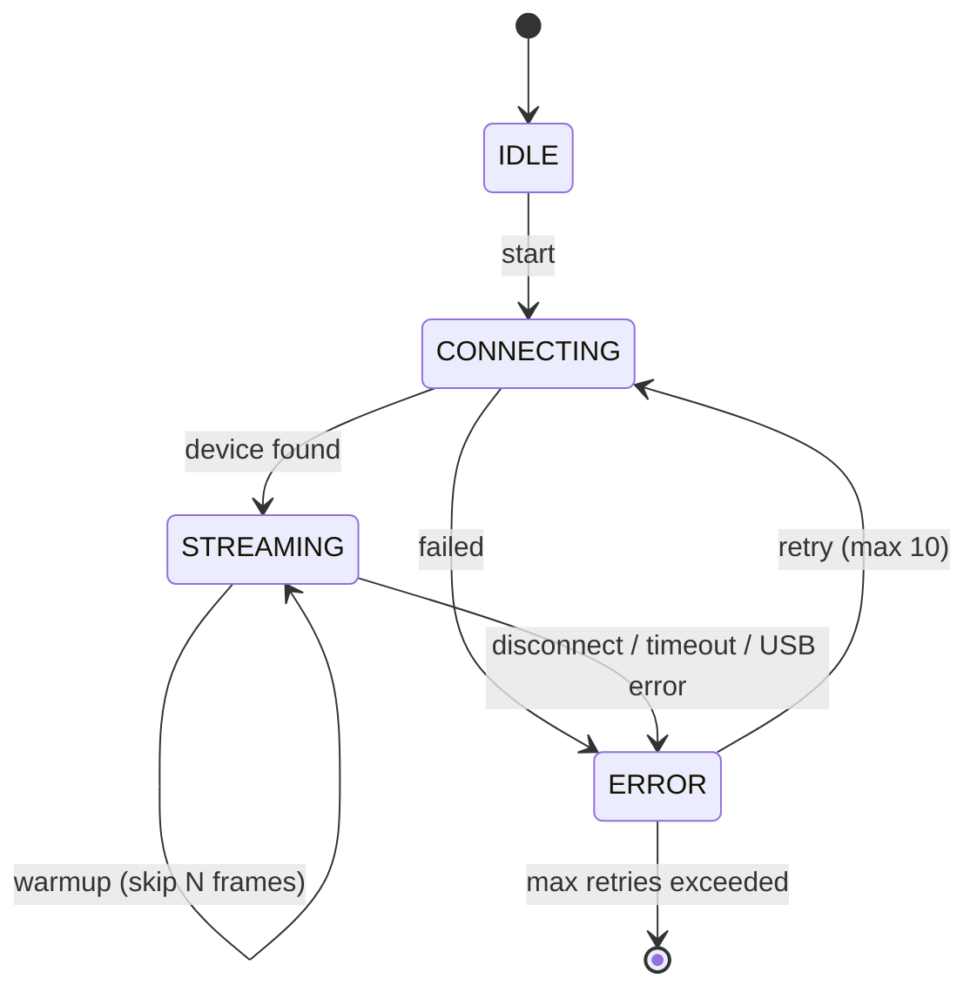

# RealSense D435i Driver for VIO

Custom lightweight ROS2 driver for Intel RealSense D435i, optimized for Visual-Inertial Odometry (VIO) with OpenVINS on indoor drones.

## Architecture

```mermaid
graph TD
    subgraph D435i["Intel RealSense D435i"]
        IR1[IR Left - infra1]
        IR2[IR Right - infra2]
        IMU_HW[IMU - BMI085]
    end

    subgraph Driver["d435i_node - ROS2 C++"]
        SM[State Machine]
        VALIDATE[Timestamp Validation]
        PUB_IMG[Image Publisher]
        PUB_IMU[IMU Publisher]
        DIAG[Diagnostics]

        SM -->|STREAMING| VALIDATE
        VALIDATE -->|valid| PUB_IMG
        VALIDATE -->|valid| PUB_IMU
        VALIDATE -->|invalid| DIAG
        SM -->|every 5s| DIAG
    end

    subgraph Topics["ROS2 Topics"]
        T_CAM0[/cam0/image_raw\nmono8 - 30Hz]
        T_CAM1[/cam1/image_raw\nmono8 - 30Hz]
        T_IMU[/imu0\n200Hz]
    end

    subgraph VIO["OpenVINS - ov_msckf"]
        MSCKF[Stereo + IMU Fusion]
        ODOM[/ov_msckf/odomimu]
    end

    IR1 -->|USB 3.x| PUB_IMG
    IR2 -->|USB 3.x| PUB_IMG
    IMU_HW -->|USB 3.x| PUB_IMU

    PUB_IMG --> T_CAM0
    PUB_IMG --> T_CAM1
    PUB_IMU --> T_IMU

    T_CAM0 --> MSCKF
    T_CAM1 --> MSCKF
    T_IMU --> MSCKF
    MSCKF --> ODOM
```

## State Machine



| State | Description |
|-------|------------|
| IDLE | Khoi tao, chua ket noi |
| CONNECTING | Dang tim va ket noi D435i |
| STREAMING | Warmup -> publish data binh thuong |
| ERROR | Loi, cho retry reconnect |

## Features

### Core
- **Stereo IR streaming** — infra1 + infra2, mono8, 848x480@30fps
- **IMU streaming** — accel 200Hz + gyro 200Hz, publish tung sample
- **Pre-allocated buffers** — giam ~24MB/s memory allocation
- **YAML config** — cau hinh qua file, khong can sua code

### Data Quality
- **Global time sync** — dong bo timestamp hardware voi system clock
- **Timestamp validation** — chan timestamp di nguoc hoac nhay bat thuong (>2s gap)
- **Frame drop detection** — phat hien mat frame, canh bao khi VIO co the bi drift
- **Warmup period** — skip 30 frame dau cho IMU + auto-exposure on dinh

### Robustness
- **Auto reconnect** — tu dong ket noi lai khi mat camera (max 10 lan, delay 3s)
- **Auto-exposure IR** — tu dong dieu chinh exposure khi anh sang thay doi (indoor)
- **Emitter control** — tat IR emitter mac dinh cho VIO
- **Hz monitoring** — canh bao khi camera Hz giam duoi 80% target

### Diagnostics (log moi 5 giay)
```
[DIAG] cam=30.0Hz imu=200.0Hz drops=0 ts_errors=0
```
- `cam` — actual camera framerate
- `imu` — actual IMU rate
- `drops` — so frame bi mat (phat hien qua frame number gap)
- `ts_errors` — so lan timestamp bat thuong

## Package Structure

```
realsense_d435i/
├── config/
│   └── d435i_params.yaml       # Cau hinh stream, IMU, topic
├── docs/
│   └── README.md               # Tai lieu nay
├── include/
│   └── realsense_d435i/
│       └── d435i_driver.hpp    # Header: structs, state machine
├── launch/
│   └── d435i.launch.py         # ROS2 launch file
├── src/
│   ├── d435i_driver.cpp        # Implementation chinh
│   └── d435i_node.cpp          # Entry point
├── CMakeLists.txt
└── package.xml
```

## Internal Design

### Structs

| Struct | Purpose |
|--------|---------|
| `StreamConfig` | Camera/IMU parameters tu YAML |
| `ImageBuffer` | Pre-allocated left/right Image msg |
| `ImuCache` | Luu accel/gyro gan nhat de ghep cap |
| `Diagnostics` | Frame count, drop count, timestamp tracking |

### Data Flow

```
D435i Hardware
  │
  ├── IR Left  (Y8, 848x480@30fps)
  ├── IR Right (Y8, 848x480@30fps)
  ├── Accel    (XYZ, 200Hz)
  └── Gyro     (XYZ, 200Hz)
  │
  ▼
┌──────────────────────────────┐
│  poll_loop() [separate thread]│
│                              │
│  1. wait_for_frames(5000ms)  │
│  2. warmup check             │
│  3. validate timestamps      │
│  4. detect frame drops       │
│  5. publish IMU (per sample) │
│  6. publish stereo (memcpy)  │
└──────────────────────────────┘
  │
  ▼
  /cam0/image_raw ──► OpenVINS cam0
  /cam1/image_raw ──► OpenVINS cam1
  /imu0           ──► OpenVINS imu
```

## Configuration

```yaml
d435i_driver:
  ros__parameters:
    width: 848              # Resolution (848x480 or 640x480)
    height: 480
    fps: 30                 # Frame rate (30 or 60)
    enable_emitter: false   # Tat cho VIO, bat cho depth
    auto_exposure: true     # Tu dong dieu chinh exposure (indoor)

    accel_rate: 200         # Hz (63 or 200)
    gyro_rate: 200          # Hz (200 or 400)
    warmup_frames: 30       # Skip N frames dau (IMU + AE stabilize)

    topic_cam0: "/cam0/image_raw"
    topic_cam1: "/cam1/image_raw"
    topic_imu: "/imu0"
```

## Usage

```bash
# Build
cd ~/vio_ws
colcon build --packages-select realsense_d435i
source install/setup.bash

# Run voi launch file (load yaml config)
ros2 launch realsense_d435i d435i.launch.py

# Run truc tiep
ros2 run realsense_d435i d435i_node \
    --ros-args --params-file config/d435i_params.yaml

# Verify topics
ros2 topic hz /cam0/image_raw    # ~30Hz
ros2 topic hz /imu0              # ~200Hz
ros2 topic list
```

## Dependencies

| Package | Version | Purpose |
|---------|---------|---------|
| ROS2 Humble | 22.04 | Middleware |
| librealsense2-dev | >= 2.50 | D435i SDK |
| rclcpp | humble | ROS2 C++ client |
| sensor_msgs | humble | Image, Imu message types |

## Troubleshooting

| Symptom | Solution |
|---------|----------|
| No RealSense device found | Cam vao cong USB 3.0 (xanh), chay `lsusb \| grep Intel` |
| Permission denied | `sudo usermod -aG video $USER` roi logout/login |
| Low camera Hz (<24) | Kiem tra USB bandwidth, giam resolution |
| Frame drops lien tuc | Mount camera chac, kiem tra cap USB, thu cong USB khac |
| Timestamp errors | Kiem tra global_time_enabled trong log |
| Drift khi bay | Kiem tra vibration damping, calibrate lai Kalibr |
| Anh IR toi/sang bat thuong | Bat auto_exposure: true |
